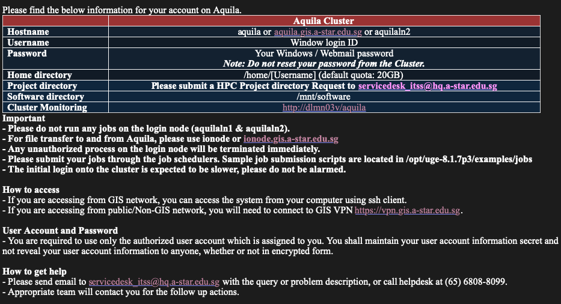

# Getting Started
This guide contains the basic codes to get you started on NGS on the cluster at GIS.

## Account
Apply for an account by emailing GIS Scientific Support and Shared Services scientificsupport@gis.a-star.edu.sg or sharedservices@gis.a-star.edu.sg. You will need
to complete a questionnaire process.

Once completed, you will receive an email with log in information and instructions:



## Disk Space
Request for space from shared services or from members in the group. The group is allocated a total space, and each project under the group is also allocated a fixed amount of space. Since the space allocation overlaps, it is unclear which one sets the space limit.

To check the amount space available, use the code `df -h .`.

## Research folder
To access the group's storage (not cluster) disk, use `smb://nlsmb.gis.a-star.edu.sg` and log in with your GIS username and password.

Location of metasub sequencing filenames.
`smb://nlsmb.gis.a-star.edu.sg/Research/CSB/CSB5/Eliza/Food microbiome 2019/MetaSub/MetaSub Analysis`

## Start up script
You can configure bash startup scripts in either `~/.bashrc` or `~/.bash_profile`.

## Resources
This guide is based on the following GIS HPC Guides:
1. [GIS Intranet](http://intranet.gis.a-star.edu.sg/opencms754/opencms/intranet/index.html)
1. [GIS (HPC) Wiki](http://wiki.gis.a-star.edu.sg/index.php/Main_Page)

## Cluster Access
```bash
ssh <username>@<node>.gis.a-star.edu.sg
```
`<username>` is the username given by GIS. It will typically start with your last name. `<nodes>` include `aquila`, `aquilaln2`, and `ionode`.

`Aquila` is the login node and should not be used to run jobs or processes. To do that, submit jobs to other nodes via `qsub` or __open an interactive session as follow__:

`qrsh -l h_rt=5:00:00,mem_free=8G -pe OpenMP 1 -q interactive.q`

Change `h_rt` and `mem_free` depending on your own needs.

## SFTP
Download [filezilla](https://filezilla-project.org/) or any other file manager.
```bash
sftp <username>@ionode.gis.a-star.edu.sg
```

## Submitting Jobs
On the cluster, check out [/opt/uge-8.1.7p3/examples/jobs/array_submitter.sh]('./links/array_submitter.md') and [/opt/uge-8.1.7p3/examples/jobs/jobnet_submitter.sh]('./links/jobnet_submitter.md') for examples on how to submit jobs.

For a simple way to submit jobs, use
`qsub -pe OpenMP 5 -l h_rt=24:00:00 -l mem_free=16G -v PATH filename.sh`
