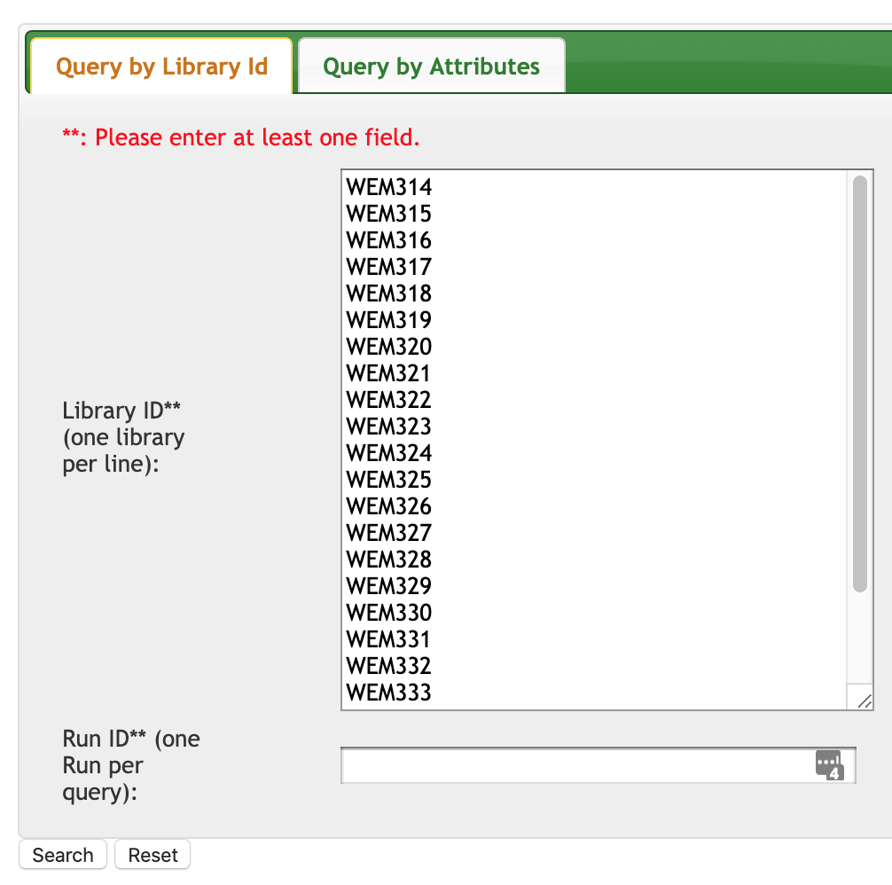
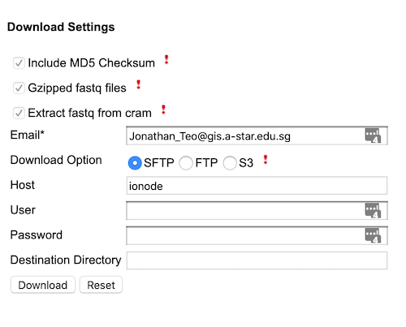

# Metagenomic Sequencing
To perform metagenomics sequencing, we will run our sequencing data through the MGS pipeline by Chen Hao. Most of the updated documentation can be found [here](https://github.com/lch14forever/shotgunmetagenomics-nf/tree/master/docs). Specifically, to set up MGS on GIS cluster, use this [guide](https://github.com/lch14forever/shotgunmetagenomics-nf/blob/master/docs/install_csb5.md).

## Set up
1. Log into the cluster and `cd` to the directory you wish to store the pipeline.
1. Clone the git repository from [github](https://github.com/lch14forever/shotgunmetagenomics-nf) using the following command:
```
git clone https://github.com/lch14forever/shotgunmetagenomics-nf.git
```
1. Set up nextflow on the cluster according to this [guide](https://www.nextflow.io/docs/latest/getstarted.html).
  * To enable the right java, `export NXF_JAVA_HOME=/etc/alternatives/java_sdk_1.8.0/` according to the [nextflow_pipeline guide](https://github.com/lch14forever/nexflow_pipelines).
  * Next, run the following set of commands.
```bash
# Make sure that Java v8+ is installed:
java -version
# Install Nextflow
curl -fsSL get.nextflow.io | bash
# Add Nextflow binary to your PATH:
mv nextflow ~/bin
# OR system-wide installation:
# sudo mv nextflow /usr/local/bin
```

## SRA
Use the [SRA_website](https://intranet.gis.a-star.edu.sg:8100/cas/login?service=http%3A%2F%2Fplap12v.gis.a-star.edu.sg%3A8080%2Fsra-ui%2Fj_spring_cas_security_check) to access raw sequencing data on the GIS repository. You have two options to transfer file off SRA to your disk on the cluster or your personal device.
1. Web UI
2. Command-Line-Interface (CLI)

Make sure before transferring that you are allocated sufficient disk space to store all the raw files. Each set of paired reads will be roughly 1GB in size.

### WEB UI
You can either download the sequences directly to your computer, or you can direct the download to a server via sftp. The figures below will show you how to retrieve the sequences and the section to configure an sftp download.

{: style="width:300px"}{: style="width:350px"}

### CLI
This [wiki](http://wiki.gis.a-star.edu.sg/index.php/SRAQuery) contains more codes to move and transfer raw files from the depository.

To check if the library exist, use either <del>[SRA_website](https://intranet.gis.a-star.edu.sg:8100/cas/login?service=http%3A%2F%2Fplap12v.gis.a-star.edu.sg%3A8080%2Fsra-ui%2Fj_spring_cas_security_check) or</del> the command line `/mnt/software/unstowable/archive/jdk8/bin/java -jar /mnt/software/bin/SRAQuery.jar -lib MUX10763`.

For example, _location of metasub sequencing filenames._
```
smb://nlsmb.gis.a-star.edu.sg/Research/CSB/CSB5/Eliza/Food microbiome\ 2019/MetaSub/MetaSub Analysis
```

```bash
echo "/mnt/software/unstowable/archive/jdk8/bin/java -jar /mnt/software/bin/SRAQuery.jar -lib MUX10823 -compress -extract /mnt/<...your destination...>" | qsub -pe OpenMP 5 -l h_rt=24:00:00 -l mem_free=16G -v PATH
```
Here is an example on how to download multiple runs with a bash for loop.
```bash
#!/usr/bin/env bash
for VARIABLE in 10763 10777 10767 10764 10823
do
  export SQRUN=MUX$VARIABLE
  export DIR=/home/teojyj/proj_metasub/data/SRA_data/$SQRUN/
  echo "/mnt/software/unstowable/archive/jdk8/bin/java -jar /mnt/software/bin/SRAQuery.jar \
  -lib $SQRUN -compress -extract $DIR" | \
  qsub -pe OpenMP 5 -l h_rt=24:00:00 -l mem_free=16G -v PATH -e $DIR \
  -o $DIR
done
```
## Running the pipeline

When $a \ne 0$, there are two solutions to $ax^2 + bx + c = 0$ and they are
$$x = {-b \pm \sqrt{b^2-4ac} \over 2a}.$$
