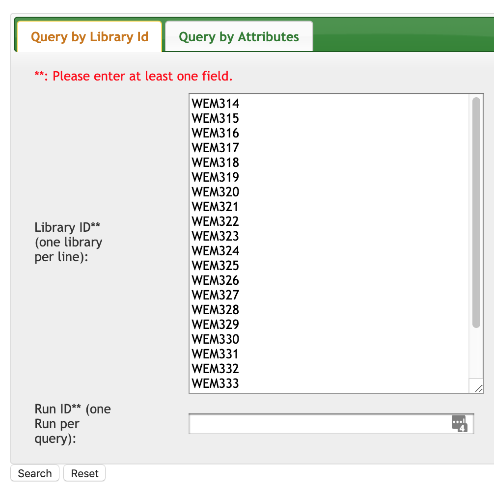

# Metagenome Sequencing
_For an overview of metagenome sequencing, refer to this [section](../MGS/overview.md)._

To perform metagenomics sequencing analysis, we will run our sequencing data through the MGS pipeline by Chen Hao. The pipeline focuses on taxonomic profiling primarily. Most of the updated documentation can be found [here](https://github.com/lch14forever/shotgunmetagenomics-nf/tree/master/docs). Specifically, to set up MGS on GIS cluster, use this [guide](https://github.com/lch14forever/shotgunmetagenomics-nf/blob/master/docs/install_csb5.md).

## Set up
1. Log into the cluster and `cd` to the directory you wish to store the pipeline.
1. Clone the git repository from [github](https://github.com/lch14forever/shotgunmetagenomics-nf) using the following command:
```
git clone https://github.com/lch14forever/shotgunmetagenomics-nf.git
```
1. Set up nextflow on the cluster according to this [guide](https://www.nextflow.io/docs/latest/getstarted.html).
  * To enable the right java, `export NXF_JAVA_HOME=/etc/alternatives/java_sdk_1.8.0/` according to the [nextflow_pipeline guide](https://github.com/lch14forever/nexflow_pipelines).
  * Next, run the following set of commands.
```bash
# Make sure that Java v8+ is installed:
java -version
# Install Nextflow
curl -fsSL get.nextflow.io | bash
# Add Nextflow binary to your PATH:
mv nextflow ~/bin
# OR system-wide installation:
# sudo mv nextflow /usr/local/bin
```

## SRA
Use the [SRA_website](https://intranet.gis.a-star.edu.sg:8100/cas/login?service=http%3A%2F%2Fplap12v.gis.a-star.edu.sg%3A8080%2Fsra-ui%2Fj_spring_cas_security_check) to access raw sequencing data on the GIS repository. You have two options to transfer file off SRA to your disk on the cluster or your personal device.
1. Web UI
2. Command-Line-Interface (CLI)

Make sure before transferring that you are allocated sufficient disk space to store all the raw files. Each set of paired reads will be roughly 1GB in size.

### WEB UI
You can either download the sequences directly to your computer, or you can direct the download to a server via sftp. The figures below will show you how to retrieve the sequences and the section to configure an sftp download.

{: style="width:300px"}{: style="width:350px"}

### CLI
This [wiki](http://wiki.gis.a-star.edu.sg/index.php/SRAQuery) contains more codes to move and transfer raw files from the depository.

To check if the library exist, use either <del>[SRA_website](https://intranet.gis.a-star.edu.sg:8100/cas/login?service=http%3A%2F%2Fplap12v.gis.a-star.edu.sg%3A8080%2Fsra-ui%2Fj_spring_cas_security_check) or</del> the command line `/mnt/software/unstowable/archive/jdk8/bin/java -jar /mnt/software/bin/SRAQuery.jar -lib MUX10763`.

For example, _location of metasub sequencing filenames._
```
smb://nlsmb.gis.a-star.edu.sg/Research/CSB/CSB5/Eliza/Food microbiome\ 2019/MetaSub/MetaSub Analysis
```

```bash
echo "/mnt/software/unstowable/archive/jdk8/bin/java -jar /mnt/software/bin/SRAQuery.jar -lib MUX10823 -compress -extract /mnt/<...your destination...>" | qsub -pe OpenMP 5 -l h_rt=24:00:00 -l mem_free=16G -v PATH
```
Here is an example on how to download multiple runs with a bash for loop.
```bash
#!/usr/bin/env bash
for VARIABLE in 10763 10777 10767 10764 10823
do
    export SQRUN=MUX$VARIABLE
    export DIR=/home/teojyj/proj_metasub/data/SRA_data/$SQRUN/
    echo "/mnt/software/unstowable/archive/jdk8/bin/java -jar /mnt/software/bin/SRAQuery.jar \
    -lib $SQRUN -compress -extract $DIR" | \
    qsub -pe OpenMP 5 -l h_rt=24:00:00 -l mem_free=16G -v PATH -e $DIR \
    -o $DIR
done
```
## Running the pipeline
Here is an example on how to run the pipeline
```bash
/home/teojyj/proj_metasub/code/metagenomics/shotgunmetagenomics-nf/main.nf -profile gis --read_path /home/teojyj/proj_metasub/data/SRA_data/MUX10763/WEM155
```
* By specifying `-profile gis`, Nextflow loads the `./conf/gis.config`, which specifies parameters, executor and loads the correct conda environment everytime a process labeled [name] is executed. See example below.
    ```
    withName:"DECONT" {
        beforeScript = { ". /mnt/software/unstowable/miniconda3-4.6.14/etc/profile.d/conda.sh; conda activate shotgunMetagenomics_fastp_v0.20.0 " }
    }
    ```
* For other profiles such as `./conf/base.config`, Nextflow loads various containers from an online docker repository instead.
* The pipeline uses [Nextflow DSL2]('../MGS/pipeline.md'). The main difference betwen DSL1 and DSL2 is how Nextflow manages processes{}. Instead of running a process{} the moment it is defined, Nextflow DSL2 loads the process{}, and only runs it when referenced in workflow{}. A resulting benefit is that instead of specifying all connenctions between processes in the input and output section, you can specify the connnections as process 'arguments' in workflow{} instead.

It feeds paired reads through the following workflow (found in `main.nf`):
```groovy
workflow{
    DECONT(ch_bwa_idx, ch_reads)

    if(profilers.contains('kraken2')){
        KRAKEN2(ch_kraken_idx, DECONT.out[0])
        BRACKEN(ch_kraken_idx, KRAKEN2.out[1], Channel.from('s', 'g'))
        SPLIT_KRAKEN2(KRAKEN2.out[0])
    }
    if(profilers.contains('metaphlan2')){
        METAPHLAN2(ch_metaphlan2_idx, DECONT.out[0])
        SPLIT_METAPHLAN2(METAPHLAN2.out[0])
    }
    if(profilers.contains('humann2')){
        HUMANN2_INDEX(ch_humann2_nucleotide, METAPHLAN2.out)
        HUMANN2(ch_humann2_protein, DECONT.out[0].join(HUMANN2_INDEX.out))
    }
}
```

### Decontamination
These are the input files parsed by Nextflow.
```groovy
ch_reads = Channel
    .fromFilePairs([params.read_path + '/**{R,.,_}{1,2}*f*q*'], flat: true, checkIfExists: true) {file -> file.name.replaceAll(/[-_].*/, '')}
ch_bwa_idx = file(params.decont_refpath)
```
```bash
fastp -i $reads1 -I $reads2 --stdout -j $output.json -h $output.html | \\
bwa mem -p -t $task.cpus ${index_path}/${params.index} - | \\
samtools fastq -f12 -F256  -1  ${prefix}_fastpdecont_1.fastq.gz -2 ${prefix}_fastpdecont_2.fastq.gz -
```
For example
```bash
source /mnt/software/unstowable/miniconda3-4.6.14/etc/profile.d/conda.sh
conda activate shotgunMetagenomics_fastp_v0.20.0

fastp -i p144C_R1.fastq -I p144C_R2.fastq --stdout -j p144C.json -h p144C.html | bwa mem -p -t 1 test/test_idx - | samtools fastq -f12 -F256  -1  p144C_fastpdecont_1.fastq.gz -2 p144C_fastpdecont_2.fastq.gz -
```

### Kraken2 + Bracken
These are the input files beind parsed by Nextflow.
```bash
kraken2 \\
--db $index_path \\
--paired \\
--threads $task.cpus \\
--output ${prefix}.kraken2.out \\
--report ${prefix}.kraken2.tax \\
$reads1 $reads2 \\
--use-mpa-style

### run again for bracken
kraken2 \\
--db $index_path \\
--paired \\
--threads $task.cpus \\
--report ${prefix}.kraken2.report \\
$reads1 $reads2 \\
--output -

### gzip ${prefix}.kraken2.out
rm ${prefix}.kraken2.out

TAX=$tax

bracken -d $index_path \\
-i $kraken2_report \\
-o ${prefix}.bracken.${tax} \\
-l \${TAX^^}

sed 's/ /_/g' ${prefix}.bracken.${tax} | \\
tail -n+2 | \\
cut -f 1,7 > ${prefix}.bracken.${tax}.tsv
```

For example,

```bash
source /mnt/software/unstowable/miniconda3-4.6.14/etc/profile.d/conda.sh
conda activate shotgunMetagenomics_kraken_v2.0.8

kraken2 --db $index_path --paired --threads $task.cpus --output p144C.kraken2.out --report p144C.kraken2.tax p144C_fastpdecont_1.fastq.gz p144C_fastpdecont_2.fastq.gz --use-mpa-style

### run again for bracken
kraken2 --db $index_path --paired --threads $task.cpus --report p144C.kraken2.report p144C_fastpdecont_1.fastq.gz p144C_fastpdecont_2.fastq.gz --output -

### gzip ${prefix}.kraken2.out
rm p144C.kraken2.out
bracken -d $index_path -i $kraken2_report -o p144C.bracken.s -l S
bracken -d $index_path -i $kraken2_report -o p144C.bracken.g -l G
sed 's/ /_/g' p144C.bracken.s | tail -n+2 | cut -f 1,7 > p144C.bracken.s.tsv
sed 's/ /_/g' p144C.bracken.g | tail -n+2 | cut -f 1,7 > p144C.bracken.g.tsv
```


### MetaPhlAn
```bash
metaphlan2.py ${reads1},${reads2} \\
    --mpa_pkl ${index_path}/${params.pkl} \\
    --bowtie2db ${index_path}/${params.index} \\
    --bowtie2out ${prefix}.metaphlan2.bt2.bz2 \\
    -s ${prefix}.metaphlan2.sam.bz2 \\
    --nproc $task.cpus \\
    --input_type multifastq \\
    > ${prefix}.metaphlan2.tax
```
For example,

```bash
source /mnt/software/unstowable/miniconda3-4.6.14/etc/profile.d/conda.sh
conda activate shotgunMetagenomics_metaphlan2_v2.7.7

metaphlan2.py p144C_fastpdecont_1.fastq.gz p144C_fastpdecont_2.fastq.gz --mpa_pkl path_to_idx/mpa_v20_m200.pkl --bowtie2db path_to_idx/mpa_v20_m200 --bowtie2out p144C.metaphlan2.bt2.bz2 -s p144C.metaphlan2.sam.bz2 --nproc $task.cpus --input_type multifastq > p144C.metaphlan2.tax
```

### HUMANN
```bash
echo $PATH
touch customized.ffn
mkdir index

for i in `awk -v threshold=${params.presence_threshold} ' \$2>threshold {print \$1}' $metaphlan2_tax | \\
    grep -o "g__.*s__.*" |  \\
    grep -v "t__" | \\
    grep -v "unclassified" | \\
    sed 's/|/./' `; \\
do
    FILE=${humann2_nucleotide}/\${i}.centroids.${params.humann2db_version}.ffn.gz
    if [ -f "\$FILE" ]; then
       zcat  \$FILE >> customized.ffn
    fi
done

bowtie2-build customized.ffn index/customized.ffn

rm  customized.ffn

echo $PATH
zcat $reads1 $reads2 | \\
sed 's/ //g' | \\
bowtie2 -p $task.cpus -x ${index}/customized.ffn -U - | \\
humann2 -i - \\
--output-basename ${prefix}.humann2 \\
--remove-temp-output \\
--input-format sam \\
--protein-database $humann2_protein \\
--threads $task.cpus \\
-o ./

humann2_renorm_table --input ${prefix}.humann2_genefamilies.tsv \\
--output ${prefix}.humann2_genefamilies.relab.tsv \\
--units relab

humann2_renorm_table --input ${prefix}.humann2_pathabundance.tsv \\
--output ${prefix}.humann2_pathabundance.relab.tsv \\
--units relab
```

For example,

```bash
source /mnt/software/unstowable/miniconda3-4.6.14/etc/profile.d/conda.sh
conda activate shotgunMetagenomics_metaphlan2_v2.7.7

echo $PATH
touch customized.ffn
mkdir index
for i in `awk -v threshold=0.01 ' \$2>threshold {print \$1}' p144C.metaphlan2.tax | grep -o "g__.*s__.*" |  grep -v "t__" | grep -v "unclassified" | sed 's/|/./' `
do
    FILE=Path_to_humann2_chocophlan_database/\${i}.centroids.v0.1.1.ffn.gz
    if [ -f "\$FILE" ]; then
       zcat  \$FILE >> customized.ffn
    fi
done
bowtie2-build customized.ffn index/customized.ffn
rm  customized.ffn
zcat p144C_fastpdecont_1.fastq.gz p144C_fastpdecont_2.fastq.gz | sed 's/ //g' | bowtie2 -p $task.cpus -x path_to_humann_idx_out/customized.ffn -U - | humann2 -i - --output-basename p144C.humann2 --remove-temp-output --input-format sam --protein-database Path_to_humann2_protein_database --threads $task.cpus -o ./
humann2_renorm_table --input p144C.humann2_genefamilies.tsv --output p144C.humann2_genefamilies.relab.tsv --units relab
humann2_renorm_table --input p144C.humann2_pathabundance.tsv --output p144C.humann2_pathabundance.relab.tsv --units relab
```
