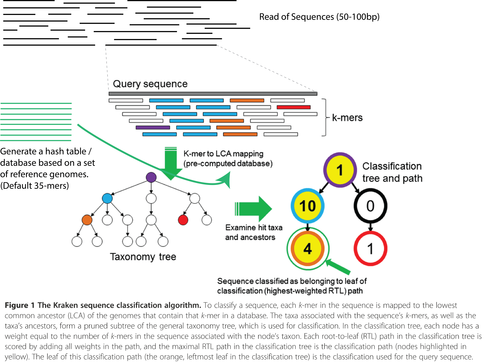
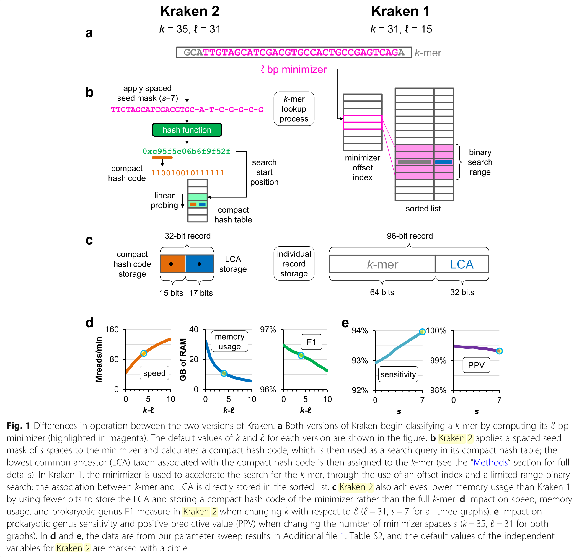
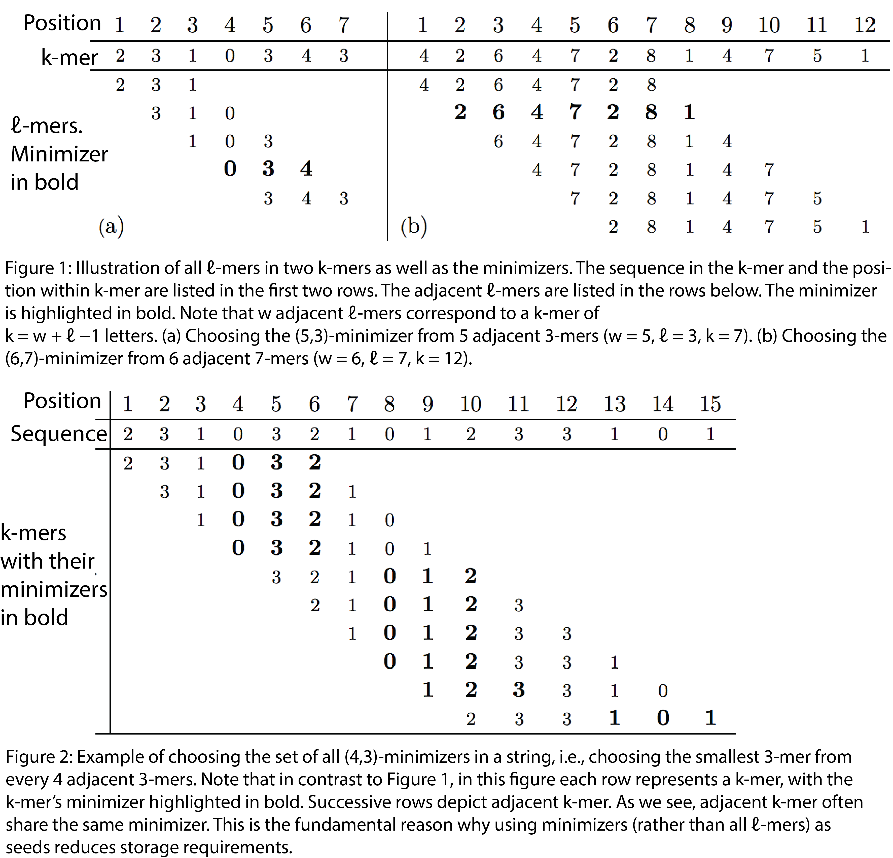
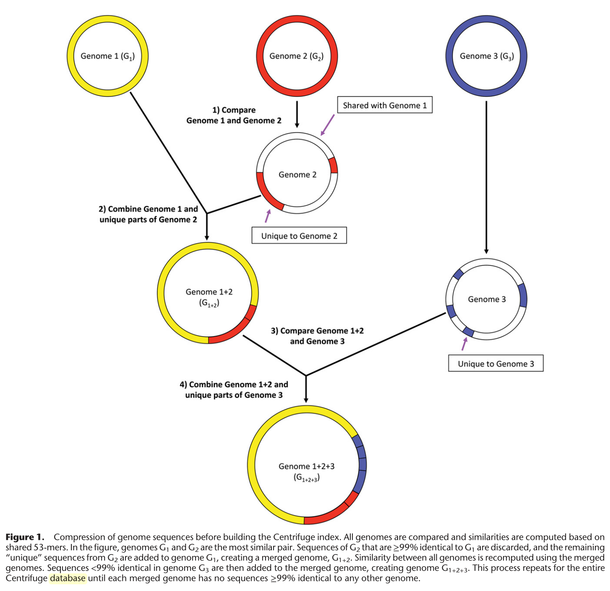
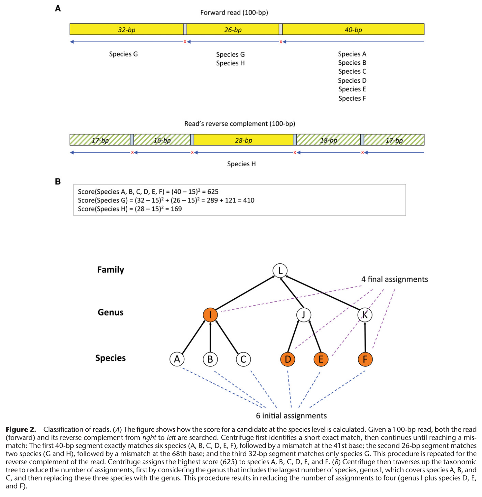

# Metagenomic Classifiers & Abundance Estimation Programs

## Comparison of Metagenomic Classifier and Taxonomic Abundance Profiler

Abundance estimation programs assign taxonomic labels to reads (classifier) and count them to calculate the relative abundance of organisms from different taxom.

Refer to the [website](http://ccb.jhu.edu/software/choosing-a-metagenomics-classifier/) and [Kraken2](https://genomebiology.biomedcentral.com/articles/10.1186/s13059-019-1891-0) paper to read about kraken's authors comparison of the different classifiers.

* Kraken 1
    * Old and deprecated
* KrakenUniq
    * "In cases where false positives can be detrimental to the overall interpretation of the results (e.g. in pathogen identification/diagnoses), KrakenUniq is best suited to help filter false positives and validate classification."
* Kraken 2
    * "With default settings, Centrifuge will use slightly less memory than Kraken 2. Kraken 2 relies on a **probabilistic hash table** for k-mers."
* Centrifuge
    * "Centrifuge uses an **FM-index (related to BWA)** and within-species compression."
* CLARK
* Kaiju
* Bracken
* MetaPhlAn

## Kraken

### Kraken 1

[Kraken](https://genomebiology.biomedcentral.com/articles/10.1186/gb-2014-15-3-r46) is a k-mer based taxonomic classifying tool for metagenomic sequencing data. It generates a k-mer hash lookup table from known reference genomes and assigns the lowest common ancestor (LCA) to each k-mer. Given a seqquencing read (S), break down S into a series of k-mers. Instead of aligning sequencing reads to the reference genomes, look up the hash table for an _exact match_ of the k-mers and assign it the respective LCA.

Using the LCA assignments, we create a truncated and weighted phylogenetic profile of the k-mers and look for the root-to-leaf (RTL) path with the highest score. The leaf with the highest RTL score is now assigned to (S). Repeat for all the other S in the library. See diagram below for more details.



"Building the standard Kraken database downloads and uses all complete bacterial, archeal, and viral genomes in Refseq at the time of the build." To build a standard database, you will need roughly 200GB of space, and a huge RAM to load the hash table. Due to the sheer size of the database, it is unlike that a home computer will be appropriately speced. Instead of making a pre-built hash table available for download, Kraken provides a smaller database (MiniKraken) that can be run on computeres with 16GB or less RAMs.

The defaults are $k=31$ and $l=15$.

###Kraken 2
[Kraken 2](https://genomebiology.biomedcentral.com/articles/10.1186/s13059-019-1891-0) makes several improvements to the hash table, resulting in a very slightly less accurate assignment in return for a faster database build time and smaller memory usage. The key improvements are highlighted below.

"**Compact hash table** allows Kraken 2 to use 32 bits for a key-value pair, a reduction compared to the 96 bits used by Kraken 1 (64 bits for key, 32 for value) (Figure. 1c). But it also creates a new way in which keys can “collide,” in turn impacting the accuracy of queries to the CHT. Two distinct keys can be treated as identical by the CHT if they share the same compact hash code and their starting search positions are close enough to cause a linear probe to encounter a stored matching compact hash code before an empty cell is found. **This property gives the CHT its probabilistic nature**, in that two types of false-positive query results are possible: either (a) a key that was not inserted can be re- ported as present in the table or (b) the values of two keys can be confused with each other."

"Kraken 2 performs **hash-based subsampling** to reduce the **memory requirement of the databases**. It estimates the required capacity of the hash table given the k, l, and s values chosen along with the sequence data in a database’s reference genomic library. If the estimated required capacity is larger than the maximum requested size, then the minimizers will be subsampled further using a hash function.
1. Given an estimated required capacity S′ and a maximum user-specified capacity of S (S < S′), we can calculate the value f= S/S′, which is the fraction of available minimizers that the user will be able to hold in their database.
1. A minimum allowable hash value of v = (1 − f)∙M can also be calculated, where M is the maximum value output by hash function h.
1. Any minimizer in the reference library with a hash code less than v will not be inserted into the hash table.
1. This value v is also provided to the classifier so that only minimizers with hash codes greater than or equal to v will be used to probe the hash table, saving the search failure runtime penalty that would be incurred by searching for minimizers guaranteed not to be in the hash table."



The defaults are $k=35$ and $l=31$.
* [Kraken 2 Manual](https://ccb.jhu.edu/software/kraken2/index.shtml?t=manual#kraken-2-databases)

### Bracken
To calculate abundance, Kraken 1/2 should be combined with Bracken. "Bracken (Bayesian Reestimation of Abundance with KrakEN) is a highly accurate statistical method that computes the abundance of species in DNA sequences from a metagenomics sample."

###Minimizers

The following excerpts are from this [link](http://www.cs.utoronto.ca/~wayne/research/papers/minimizers.pdf).

"Only minimizers of the k-mers in the query sequences are used as database queries. Similarly, only minimizers of the k-mers in the reference sequences in the database's genomic library are stored in the database. We will also refer to the minimizers as ℓ-mers, where ℓ ≤ k. All k-mers are considered to have the same LCA as their minimizer's database LCA value."



"Not all letters (digits) in Figure 2 are contained in minimizers: positions 1–3, 7, and 12 are not covered. Although it may not be required for every letter to be covered by a minimizer, it may be desirable for some applications. Gaps between minimizers are caused when the minimizers of two adjacent k-mers are more than L positions apart, as in the case of the k-mers starting in positions 4 and 5 in Figure 2: the minimizer of the k-mers in position 4 covers positions 4–6, while the minimizer for the next K-mer covers positions 8–10, leaving position 7 covered by no minimizer. However, note that the minimizers of two adjacent k-mers of size W can differ in their starting positions by at most W. Thus, gaps can be at most w − ℓ in size, so setting w ≤ ℓ ensures
no gaps occur between minimizers. Then, all letters are covered except at most w − 1 at each end of the string"

In other words, to guarantee that there are no gaps, ensure that:

$$\begin{align}
w &\le l \\
k &= w+l-1 \\
k &\le 2l-1 \\
&\approx 2l
\end{align}$$

Refer to this tutorial on [minimizer](https://homolog.us/blogs/bioinfo/2017/10/25/intro-minimizer/) for a layman explanation. The code below is a rough example of how to identify minimizers of k-mers in a read.

```python
# Sequence aka read
seq="ATGCGATATCGTAGGCGTCGATGGAGAGCTAGATCGATCGATCTAAATCCCGATCGATTCCGAGCGCGATCAAAGCGCGATAGGCTAGCTAAAGCTAGCA"
#reverse
rev=seq[::-1]
# A->T, T->A
rev=rev.replace("A","X")
rev=rev.replace("T","A")
rev=rev.replace("X","T")
# G->C, C->G
rev=rev.replace("C","X")
rev=rev.replace("G","C")
rev=rev.replace("X","G")

Kmer=31
M=7
L=len(seq)

# Iterate through k-mers of sequence
for i in range(0, L-Kmer+1):
        sub_f=seq[i:i+Kmer] # forward K-mer
        sub_r=rev[L-Kmer-i:L-i] # reverse and A-T,C-G swapped K-mer

        min="ZZZZZZZZZZZZZ"
        # Iterate through l-mers of k-mers, look for minimizer
        for j in range(0, Kmer-M+1):
                # look for minimizer
                sub2=sub_f[j:j+M]
                if sub2 < min:
                        min=sub2
                sub2=sub_r[j:j+M]
                if sub2 < min:
                        min=sub2

        print sub_f,min
```

## [Centrifuge](https://www.ncbi.nlm.nih.gov/pubmed/27852649)
* Create an FM-Index of the reference sequence. <br> 
* Uses a BWA to align reads to an FM-index of reference genomes. Outputs the matches. If the number of matches is large, the algorithm will climb the phylogenetic tree to assign a higher phylo instead. <br> 

* Represent a match between read $i$ and reference genome $j$ with an indicator $C_{ij}$. $C$ is an indicator matrix.
* To find the relative abundance of species, use an **EM algorithm**. The algorithm is roughly as follow:
    1. Since each read (likely) corresponds to multiple reference genomes, we can assign a probability that the read came from a genome. Set the prob to be proportional to the relative abundance (currently unknown) of the corresponding species.
    1. Guess the initial abundances $\alpha_j$.
    1. Create a probability matrix $P$ by multiplying $C$ with $\alpha$ and normalizing the values so that each row sum to 1 i.e. the total probability that a read come from the set of genome is 1.

        | Reads\Genome | G1                       | G2                | G3                | G4                |
        |--------------|--------------------------|-------------------|-------------------|-------------------|
        | R1           | $P_{11}=\overline{C_{11}*\alpha_1}$ | $\overline{C_{12}*\alpha_2}$ | $\overline{C_{13}*\alpha_3}$ | $\overline{C_{14}*\alpha_4}$ |
        | R2           | $\overline{C_{21}*\alpha_1}$        | $\overline{C_{22}*\alpha_2}$ | $\overline{C_{31}*\alpha_3}$ | $\overline{C_{41}*\alpha_4}$ |
        | Sum          | $n_1$                    | $n_2$             | $n_3$             | $n_4$             |

    1. Sum each column. The elements in the column correspond to the total (probabilistic) reads assigned to each sequence ($n_j$).
    1. To calculate a new estimate for the relative abundance of species $j$, normalize $n_j$ by the total read count. $$\alpha_j=\frac{n_j}{\sum_jn_j}$$ This estimate works assuming that the genome lengths are equal across all species. To account for genomes of different length, divide $n_j$ by genome length $l_j$ and normalize that instead. $$\alpha_j=\frac{n_j/l_j}{\sum_jn_j/l_j}$$

## [MetaPhlAn2](http://huttenhower.sph.harvard.edu/metaphlan)
"(**Met**agenomic **Phyl**ogenetic **An**alysis) **MetaPhlAn** is a computational tool for profiling the composition of microbial communities from metagenomic shotgun sequencing data. MetaPhlAn relies on unique clade-specific marker genes identified from 3,000 reference genomes...

The generation of this catalog of marker genes (**marker catalog**) uses an intraclade CDS clustering and then an extraclade sequence uniqueness assessment; the method was based loosely on our previous system for detecting core genes.It is an offline procedure that we perform regularly as a relevant set of newly sequenced microbial genomes is available, and the catalog is downloaded automatically with the associated classifier.

The MetaPhlAn classifier compares metagenomic reads against
this precomputed marker catalog **using nucleotide BLAST searches** in order to provide clade abundances for one or more sequenced metagenomes.

...the MetaPhlAn classifier **normalizes** the total number of reads in each clade by the nucleo- tide length of its markers
"
