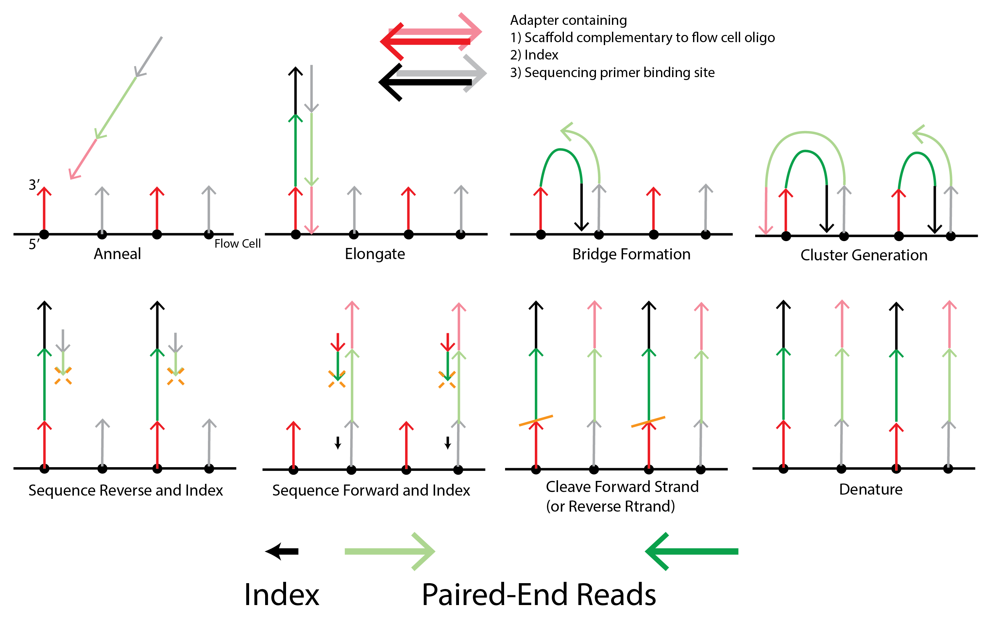

# Illumina Sequencing
Refer to this video and diagram for a brief overview of how illumina sequencing works.

<iframe width="640" height="360" src="https://www.youtube.com/embed/9YxExTSwgPM" frameborder="0" allow="accelerometer; autoplay; encrypted-media; gyroscope; picture-in-picture" allowfullscreen></iframe>

{: style="width:600px"}

# Preprocessing
## FastQC
## Trimmomatic

## decontaminate

## References
* [NGS Analysis gencore.bio.nyu.edu](https://learn.gencore.bio.nyu.edu/de-novo-genome-assembly/pre-processing-and-qc/)
* [Metagenomics Tutorial (HUMAnN2)](https://github.com/LangilleLab/microbiome_helper/wiki/Metagenomics-Tutorial-(Humann2))
