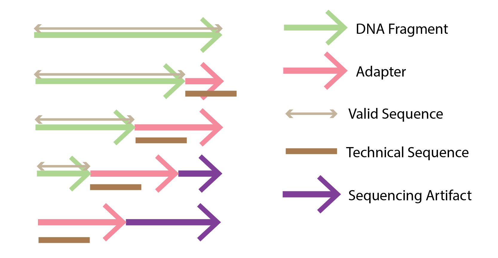
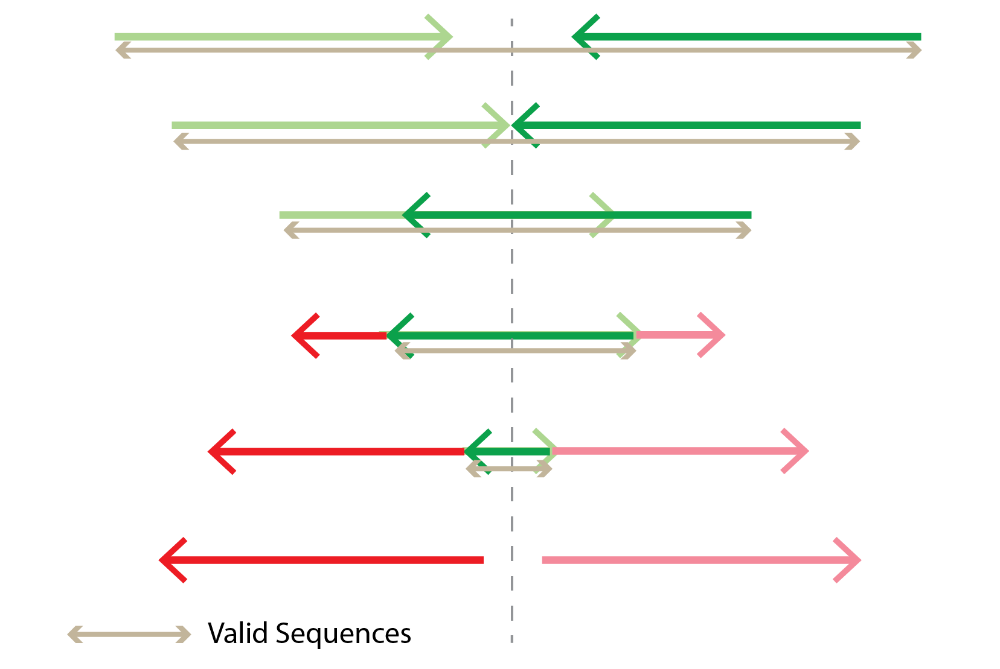
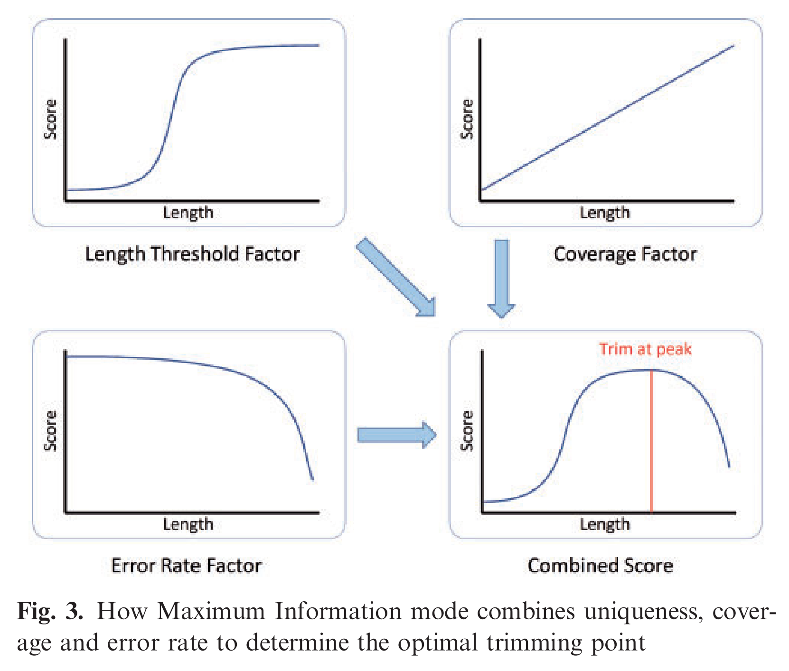

# Preprocessing

## FastQC

### Metric
* Per Base Sequence Quality
* Per Sequence Quality Scores
* Per Base Sequence Content
* Per Base GC Content
* Per Sequence GC Content
* Per Base N Content
* Sequence Length Distribution
* Duplicate Sequences
* Overrepresented Sequences
* Overrepresented Kmers

To visualize multiple fastQC, use [MultiQC](http://multiqc.info/).

* [Manual](https://dnacore.missouri.edu/PDF/FastQC_Manual.pdf)

## Fastp
It is an alternative program used to trim sequences of adapter sequences. See _trimmomatic_ for one such alternative.

## Kneaddata
It is an all in one preprocessing package that combines other packages such as bowtie host DNA removal, and trimmomatic to remove adapter sequence.

## Decontanimate
[Deconta**nim**ate](https://bitbucket.org/andreas-wilm/decontanimate/src/master/) (Not deconta**min**ate) is a software that uses bowtie indexes to speed up alignment of reads of sequences to a target genome and remove matches.

## Bowtie2
[Bowtie2](http://bowtie-bio.sourceforge.net/bowtie2/index.shtml) is an algorithm that aligns a short sequence read to a large reference genome in a way that is computationally efficient. To achieve the speed up, it creates an index using the Burrows-Wheeler transform which reduces the memory footprint to around 2.2GB for a human genome.

[Removing Host Sequence](http://www.metagenomics.wiki/tools/short-read/remove-host-sequences)
The Bowtie 2 index is based on the [FM Index of Ferragina and Manzini](http://portal.acm.org/citation.cfm?id=796543), which in turn is based on the Burrows-Wheeler transform.

## FastP
Fast P is a read trimming algorith that supposedly performs faster than Trimmomatic.

## Trimmomatic
Trimmomatic analyzes raw reads and _trim_ out sequencing artifacts and adapter sequences. In the paper, the technical sequence mentioned includes primarily the adapter sequences and other auxillary sequences that are not derived from the sample. It also _trims_ long reads based on Window Slidding and Maximal Information quality filtering. The figures below summarize the concepts.

1. Simple Model  
{: style="width:400px;"}

1. 'Palindrome' Mode  
{: style="width:400px;"}

1. Maximal Information Quality Filtering (from the paper)  
{: style="width:400px;"}

* [Paper](https://academic.oup.com/bioinformatics/article/30/15/2114/2390096)
* [Homepage](http://www.usadellab.org/cms/?page=trimmomatic)
* [Manual](http://www.usadellab.org/cms/uploads/supplementary/Trimmomatic/TrimmomaticManual_V0.32.pdf)
