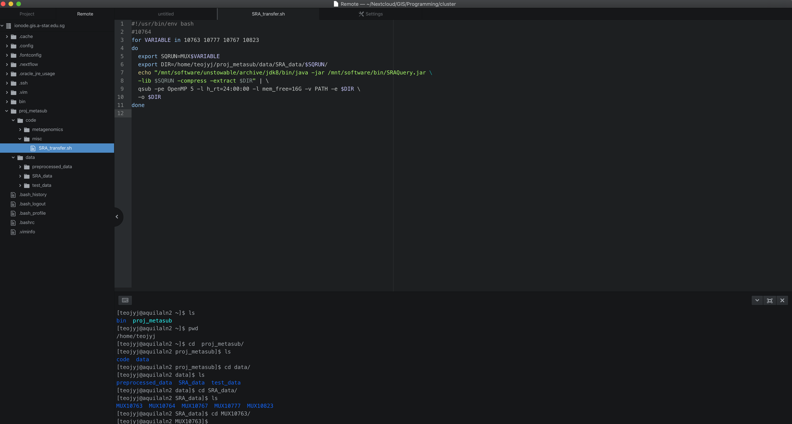

1. Figure and line break. <br>
{: style="width:400px;"}
1. [Open link in a new tab.](http://www.google.com){target=_blank}
2. [`Inline code`](https://en.support.wordpress.com/markdown-quick-reference/)
3.```bash 
echo "Code Block"
```
